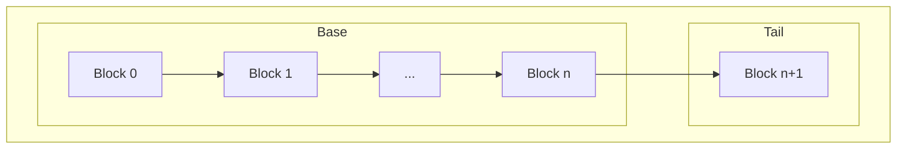
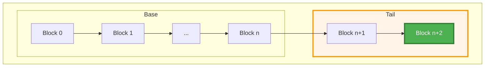
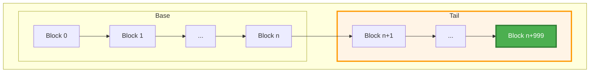
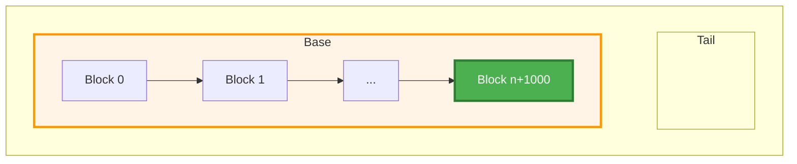
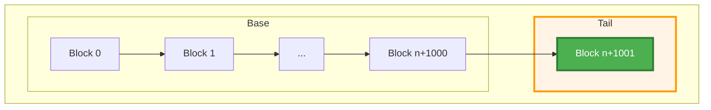

# CChain Concurrency

## Metadata

<table>
<tr>
<td width="60%" style="vertical-align: top; border: none;">

| Field | Value |
|-------|-------|
| **Type** | Enhancement |
| **Status** | Draft |
| **Pillar** | Architecture & Performance |
| **Related Work** | [Preliminary implementation](https://github.com/alexanderwiederin/bitcoin/tree/chain-concurrency-enhancement) |
| **Date Created** | 2025-12-16 |
| **Last Updated** | 2026-01-27 |

</td>
<td width="40%" style="vertical-align: top; border: none;">


</td>
</tr>
</table>

## Summary

Improve CChain multi-threaded performance by minimizing lock hold times and
ensuring consistent snapshots through a copy-on-write design.

## Problem Statement
The current CChain implementation uses a single vector protected by `cs_main`,
creating a performance bottleneck in multi-threaded scenarios.

### Current Implementation
```cpp
class CChain
{
private:
    std::vector<CBlockIndex*> vChain; // Protected by cs_main

public:
    CBlockIndex* Tip() const
    {
        return vChain.size() > 0 ? vChain[vChain.size() - 1] : nullptr;
    }
    // All access requires holding cs_main
};
```
**Issues:**
- **Write blocking:** Writers must hold exclusive lock, blocking all readers
- **Inconsistent state:** Can not capture consistent view without holding lock
  throughout operation
- **Read contention:** Multiple readers block each other unnecessarily

**Example of Current Overhead:**
```cpp
// Current: must hold lock for entire operation or risk inconsistent state
LOCK(cs_main);
int height = chain.Height();
CBlockIndex* tip = chain.Tip();

for (int i = 0; i < height; i++) {
    process(chain[i]);
}
```

## Goals

**Primary Goals:**
The primary goals are to eliminate lock contention during concurrent read
operations, enable consistent multi-step reads, minimize lock time during writes
operations and maintain backward compatability with the existing CChain API.

**Non-Goals:**
The non-goals include improving Initial Block Download (IBD) performance and
optimizing reorganization performance.

## Proposed Solution

Use a nested copy-on-write structure to minimize data copying during chain
updates while maintaining consistency.

**Architecture:**
The chain is split into two parts wrapped in a copy-on-write container:
- **Base:** `stlab::copy_on_write<std::vector<CBlockIndex*>>` - Contains
  the bulk of chain history. Shared across updates via copy-on-write, avoiding
  expensive copies.
- **Tail:** `std::vector<CBlockIndex*>` - Contains up to 1000 most
  recent blocks. Small enough to copy efficiently on each update.

Both base and tail are bundled in an `Impl` struct, itself wrapped in
`stlab::copy_on_write<Impl>`. This ensures that when taking a snapshot
(copying a CChain), base and tail are captured atomically as a consistent unit.

**Benefit:**

Sequential block appends only copy the tail vector (~500 blocks on average),
while the base vector remains shared through copy-on-write.

```cpp
class CChain
{
private:
    struct Impl {
        stlab::copy_on_write<std::vector<CBlockIndex*>> base;
        std::vector<CBlockIndex*> tail;
    };

    stlab::copy_on_write<Impl> m_impl;
    mutable Mutex m_write_mutex;

    static constexpr size_t MAX_TAIL_SIZE = 1000;

public:
    /**
     * Get a consistent snapshot of the chain.
     *
     * CChain is a regular type with value semantics. To get a snapshot,
     * simply copy the CChain object:
     *      CChain snapshot = original_chain;
     *
     * The copy is efficient due to copy-on-write: it shares the underlying
     * data until a modification is made. The snapshot provides a consistent
     * view that will not change even if the original chain is updated.
     */
    CChain() = default;
    CChain(const CChain& other) : m_impl(other.m_impl) {}
    CChain& operator=(const CChain& other)
    {
        if (this != &other) {
            m_impl = other.m_impl;
        }
        return *this;
    }
};
```

### Write Mechanics

#### Step 1: Initial State

**State:** Base contains historical blocks 0 through n. Tail contains the most
recent block n+1.


#### Step 2: Sequential Appends between 1 and `MAX_TAIL_SIZE`

**Operation:** New blocks are added by modifying the tail vector. The
`stlab::copy_on_write` implementation handles the copying:
- **Without snapshots:** Tail modified in-place (zero-copy); the base
  vector remains unchanged.
- **With snapshots:** The `Impl` struct and tail vector are copied; **the base
  vector remains shared** (not copied) between the old and new chain state.



**Performance:** Copies only the tail (average ~500 blocks), not the entire
chain.

#### Step 3: Merge Operation - Tail grows to MAX_TAIL_SIZE

**Operation:** When tail reaches 1000 blocks, base and tail are merged into a
new immutable base vector. The tail is reset to empty.


**Performance:** Copies the entire chain once per 1000 blocks.

#### Step 4: Repeat

**Operation:** Tail is modified with the new block. If snapshots exist, the
tail is copied; the base remains shared.



Fast-path appends until the next merge is triggered. **Base sharing continues** for
all 999 sequential appends until the next merge.

### Read mechanics

Snapshots provide a stable, point-in-time view of the chain. Multiple operations
on the same Snapshot always see consistent state, unaffected by concurrent
modifications to the CChain by other threads.
```cpp
// Snapshots are just copies of CChain
CChain snapshot = original_chain; // Efficient copy via copy-on-write

// All CChain operation work on the snapshot
CBlockIndex* operator[](int nHeight) const
{
    if (nHeight < 0) return nullptr;

    const auto& impl = m_impl.read(); // No lock needed for const access
    const auto& base = impl.base.read();

    if (nHeight < (int)base.size()) {
        return base[nHeight];
    }

    size_t tail_idx = nHeight - base.size();
    const auto& tail = impl.tail;
    if (tail_idx < tail.size()) {
        return tail[tail_idx];
    }

    return nullptr;
}
};
```

#### Memory Management
**Lifetime Guarantees:** Snapshots uses `stlab::copy_on_write` for automatic
memory management. The underlying data is reference-counted internally, keeping
vectors alive as long as any CChain copy holds a reference. When the last
reference is destroyed, memory is automatically freed.

### Concurrent Access Patterns

**Pattern 1: Multiple Concurrent Readers**
```cpp
// Thread 1
void* reader_thread_1(void* arg) {
    CChain snap = chain;  // Copy via copy-on-write (lock-free read of m_impl)
    // No locks held - can now read without contention
    for (int i = 0; i < snap.Height(); i++) {
        process(snap[i]);
    }
    return NULL;
}

// Thread 2
void* reader_thread_2(void* arg) {
    CChain snap = chain;  // Another efficient copy (lock-free)
    // No contention with Thread 1
    CBlockIndex* tip = snap.Tip();
    analyze(tip);
    return NULL;
}
```

**Pattern 2: Reader While Writer Updates**
```cpp
// Thread 1: Long-running read
void* reader_thread(void* arg) {
    CChain snap = chain; // Copy via atomic ref count increment

    // Long operation - chain may be updated during this time
    for (int i = 0; i < snap.Height(); i++) {
        expensive_operation(snap[i]);
    }

    // Snapshot still consistent with original state
    return NULL;
}

// Thread 2: Writer
void* validation_thread(void* arg) {
    // Writer updates chain (acquires m_write_mutex)
    chain.SetTip(new_block);  // Holds mutex during update

    // Thread 1's snapshot unaffected - still sees old state
    // New readers will see new state
    return NULL;
}
```

**Key Improvement over current implementation:**
Readers can proceed with length operations on their snapshots without holding
any locks. This eliminates the current bottleneck where `cs_main` must be held
for the entire duration of chain access.

## Open Questions

1. What is the ideal `MAX_TAIL_SIZE`? Shorter chain favors shorter tail,
       longer chain favors longer tail.
